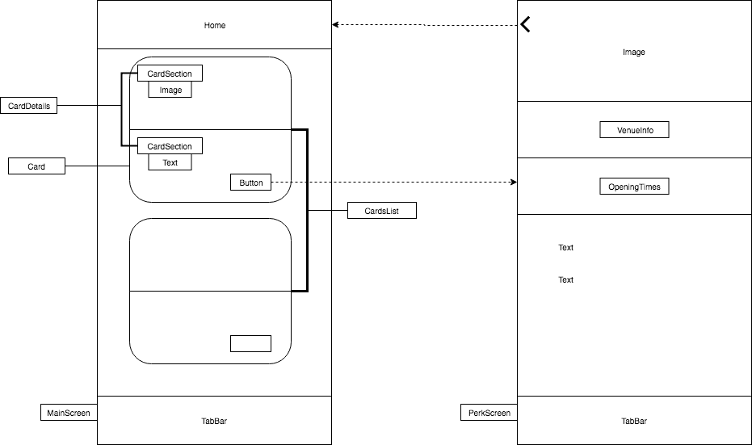

This project was bootstrapped with [Create React Native App](https://github.com/react-community/create-react-native-app).

# Model Village Tech Test
A small mobile app that shows a list of events/perks.

## Features
- Scroll through a list of events.
- Click on a button and navigate to a screen containing details of a specific event.
- Visit the event's website.
- Get the Google Maps directions to the venue from their current location.
- Call the venue.
- Navigate back to the _Browse_ tab.

## Technologies used
- React Native
  - `eslint`
  - `prettier`
  - `react-native-communications`
  - `react-native-google-maps-direction`
  - `react-native-vector-icons`
  - `react-navigation`

## Getting started
Follow the instructions below to download a copy of the project and run it locally for development purposes.

### Prerequisites
- Xcode or Android SDK
- Expo

- Verify that a current version of Node.js is installed:
```
node -v
```

### Installing

```
git clone https://github.com/antcin/mv-reactnative-coding-test.git
cd test/test
npm install
npm start
```
Follow the instructions prompted on the CLI to run the app either via simulator or Expo.

### Diagram


### User stories [MVP]
- Display a list of events
```sh
As a user,
So that I can see what is going on around me,
I would like to see a list of tiles on the Main Screen.
```


- Display details of a specific event
```sh
As a user,
So that I can see the details of a specific event,
I would like to be able to click on the event\'s tile.
```

## Approach
To begin with, I started setting up the App's backbone navigation. After that, I created the components that would appear in the main page screen. I kept a focus on making re-usable components (especially the functional ones). I then faked the API call. I fetched the list of events in `CardsList` and updated the component state in the `ComponentDidMount` lifecycle method. At this point, I had to spend some time researching how to pass the navigation props from parent to child components. At the same time, I turned my attention to creating the second screen\'s components. After having found the solution to the navigation, I then focused on improving the styling of the app.

| Example of component  | Description |
| ------------- | ------------- |
| CardsList     | fetches data from `list_response.json` using the `setState` method.   |
| CardDetails   | produces one listing details component. The listing is passed to the `CardDetails` component as a prop. |

### Challenges
- Animation
  - I was really keen on animating the opening times, however I did not manage to do it, despite the amount of research carried out.

### Improvements and future additions
- Implement _favourite_ functionality in `PerkScreen`
- Implement functionalities for additional tabs
- Use `detox` for e2e testing
- USe `Redux` for state management

### Resources
- React Native website
- Google
- StackOverFlow
- GitHub Community
- YouTube
